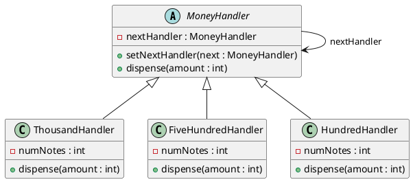
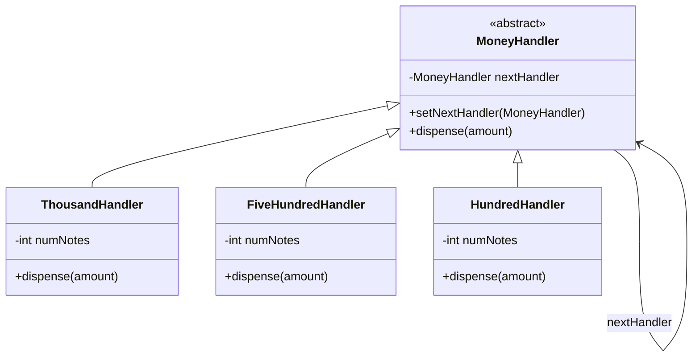
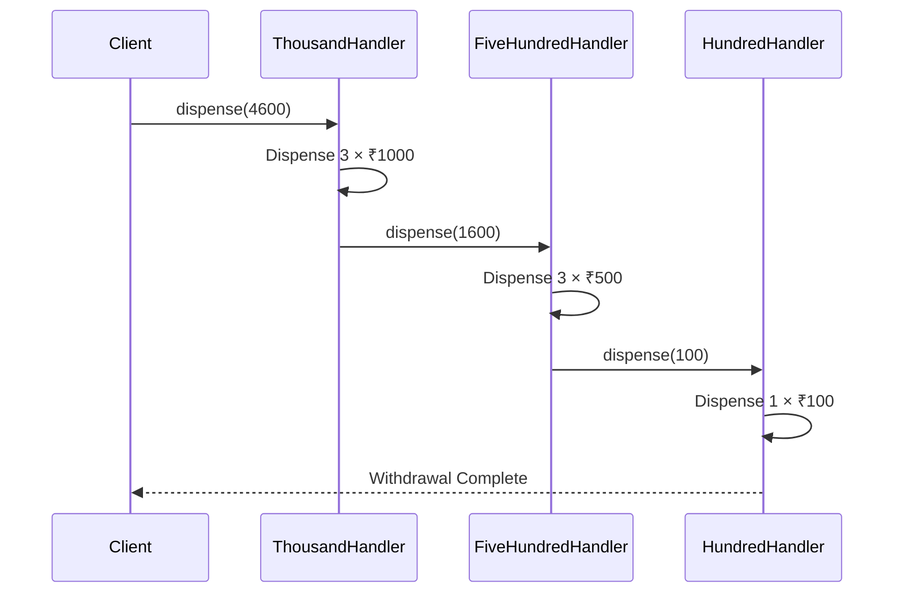

# ATM Cash Dispensing System - UML Diagram

## Class Diagram (PlantUML)



---

## UML Diagram (Mermaid)



---

# Sequence Diagram



---

# Chain of Responsibility Flow

```text
Client
   |
   v
+---------------+
| ₹1000 Handler |
+---------------+
        |
        v
+---------------+
| ₹500 Handler  |
+---------------+
        |
        v
+---------------+
| ₹100 Handler  |
+---------------+
```

## Design Pattern Used

### Chain of Responsibility

**Intent:**
Pass a withdrawal request through a chain of handlers. Each handler processes as much of the amount as possible and forwards the remaining amount to the next handler.

### Benefits

* Loose coupling between sender and receiver.
* Easy to add new denominations.
* Follows Open/Closed Principle.
* Handlers can be reordered dynamically.

### Example

Withdrawal Amount = ₹4600

1. ₹1000 Handler → Dispense 3 notes → Remaining ₹1600
2. ₹500 Handler → Dispense 3 notes → Remaining ₹100
3. ₹100 Handler → Dispense 1 note → Remaining ₹0

Output:

```text
Dispensing 3 x ₹1000 notes
Dispensing 3 x ₹500 notes
Dispensing 1 x ₹100 notes
```
