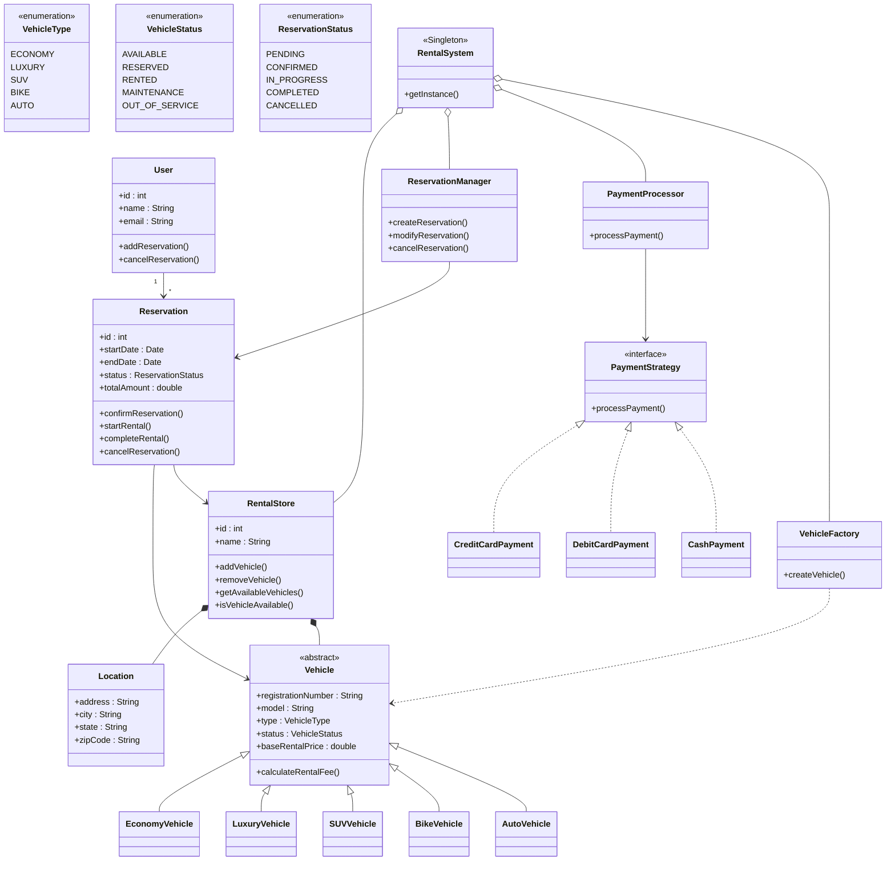

# 🚗 Car Rental System - UML Diagram

## Overview

The Car Rental System is designed using Object-Oriented Design principles and common design patterns such as:

* Factory Pattern (Vehicle Creation)
* Strategy Pattern (Payment Processing)
* Singleton Pattern (Rental System Management)

The system supports:

* Multiple Rental Stores
* Multiple Vehicle Types
* Vehicle Reservation Management
* Payment Processing
* Rental Lifecycle Tracking

---

# UML Class Diagram



---

# Relationship Explanation

## RentalSystem → RentalStore

A Rental System manages multiple rental stores.

```text
RentalSystem
    |
    +---- RentalStore
    +---- RentalStore
    +---- RentalStore
```

---

## RentalStore → Vehicle

Each store owns and manages multiple vehicles.

```text
RentalStore
    |
    +---- Vehicle
    +---- Vehicle
    +---- Vehicle
```

Composition is used because vehicles belong to a store.

---

## Vehicle Inheritance

All vehicle types inherit from the Vehicle base class.

```text
Vehicle
  |
  +-- EconomyVehicle
  +-- SUVVehicle
  +-- LuxuryVehicle
  +-- BikeVehicle
  +-- AutoVehicle
```

---

## User → Reservation

One user can create multiple reservations.

```text
User
  |
  +---- Reservation
  +---- Reservation
```

Cardinality:

```text
1 User → Many Reservations
```

---

## Reservation → Vehicle

A reservation is associated with exactly one vehicle.

```text
Reservation
      |
      +---- Vehicle
```

---

## Payment Strategy Pattern

Payment behavior is selected dynamically.

```text
PaymentProcessor
        |
        +---- PaymentStrategy
                    |
      --------------------------------
      |              |              |
CreditCard      DebitCard        Cash
```

This allows new payment methods to be added without modifying existing code.

---

# Design Patterns Used

| Pattern           | Purpose                        |
| ----------------- | ------------------------------ |
| Factory Pattern   | Vehicle Creation               |
| Strategy Pattern  | Payment Processing             |
| Singleton Pattern | Central Rental System Instance |

---

# System Workflow

```text
User
 |
 v
Search Vehicle
 |
 v
Rental Store
 |
 v
Available Vehicle
 |
 v
Reservation Manager
 |
 v
Reservation Created
 |
 v
Payment Processor
 |
 v
Reservation Confirmed
 |
 v
Rental Started
 |
 v
Vehicle Returned
 |
 v
Rental Completed
```

---

# Key Advantages

* Extensible Vehicle Types
* Modular Payment System
* Scalable Multi-Store Architecture
* Easy Maintenance
* Supports Future Enhancements
* Follows SOLID Principles
* Interview-Friendly LLD Design

```
```
