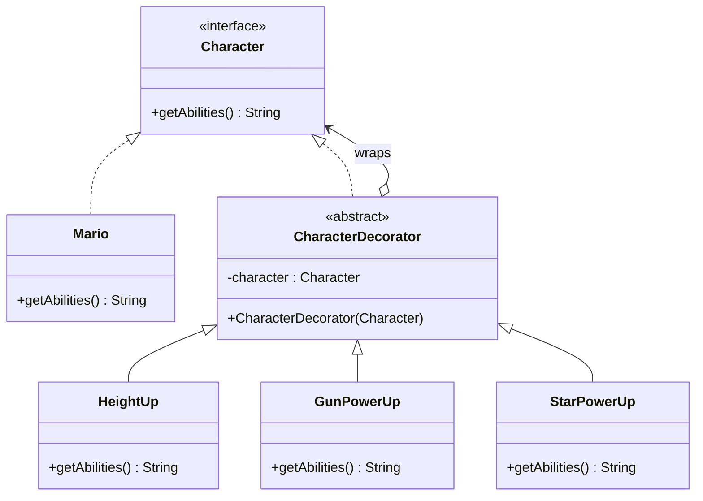

# Decorator Pattern - Mario Power-Ups

```mermaid
classDiagram

    class Character {
        <<interface>>
        +getAbilities() String
    }

    class Mario {
        +getAbilities() String
    }

    class CharacterDecorator {
        <<abstract>>
        -character : Character
        +CharacterDecorator(Character)
    }

    class HeightUp {
        +getAbilities() String
    }

    class GunPowerUp {
        +getAbilities() String
    }

    class StarPowerUp {
        +getAbilities() String
    }

    Character <|.. Mario
    Character <|.. CharacterDecorator

    CharacterDecorator <|-- HeightUp
    CharacterDecorator <|-- GunPowerUp
    CharacterDecorator <|-- StarPowerUp

    CharacterDecorator o--> Character : wraps
```
