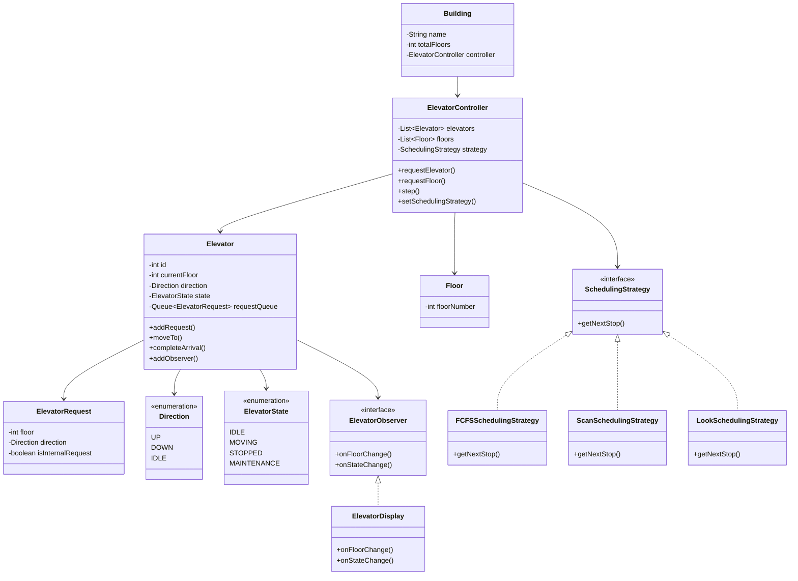
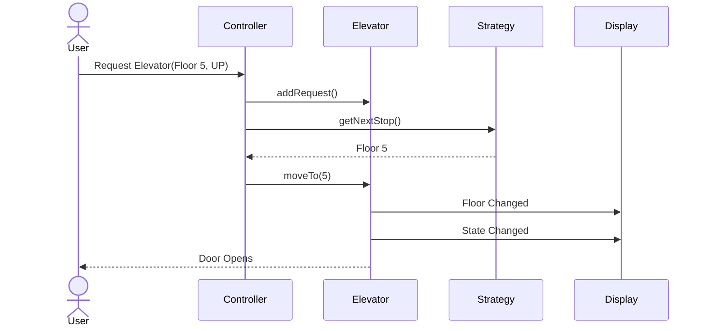
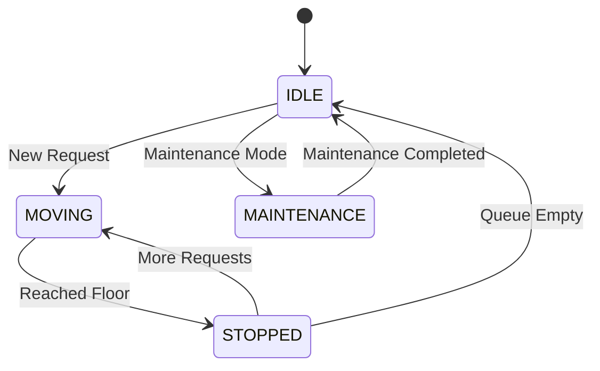
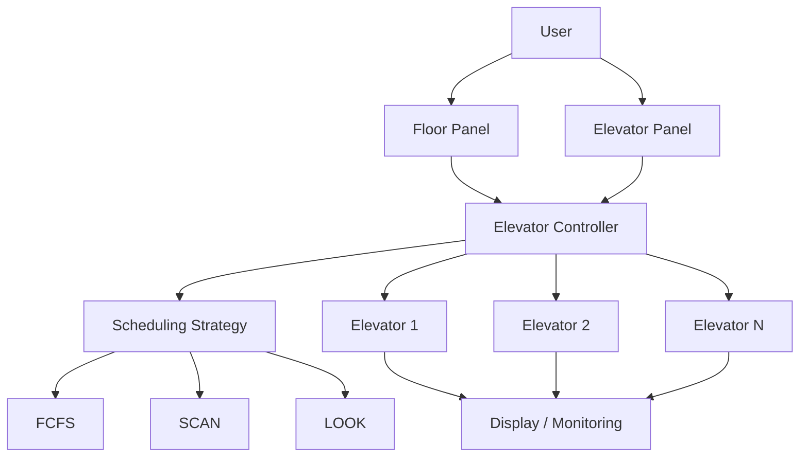
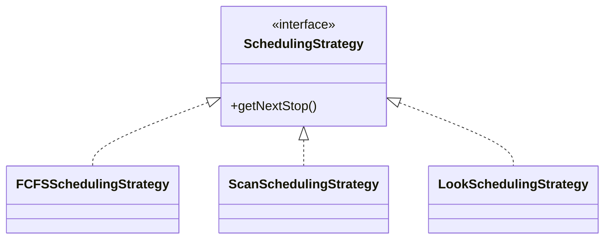
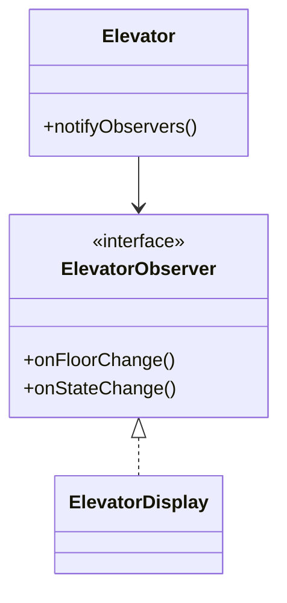
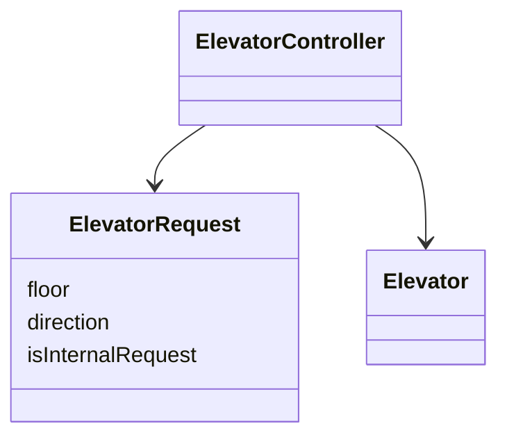

# Elevator System UML

## Class Diagram

---

# Sequence Diagram

## External Request Flow

Example:

* User is at Floor 5
* Presses UP button
* Controller assigns Elevator 1

---

# State Diagram

## Elevator Lifecycle

---

# High-Level Architecture

---

# Design Pattern UML

## Strategy Pattern

---

## Observer Pattern

---

## Command Pattern

