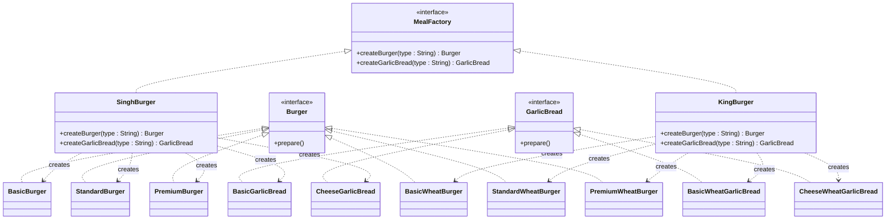

# Abstract Factory Pattern - Burger Meal Example

```mermaid
classDiagram

%% =========================
%% ABSTRACT PRODUCTS
%% =========================

class Burger {
    <<interface>>
    +prepare()
}

class GarlicBread {
    <<interface>>
    +prepare()
}

%% =========================
%% BURGER PRODUCTS
%% =========================

class BasicBurger
class StandardBurger
class PremiumBurger

class BasicWheatBurger
class StandardWheatBurger
class PremiumWheatBurger

Burger <|.. BasicBurger
Burger <|.. StandardBurger
Burger <|.. PremiumBurger

Burger <|.. BasicWheatBurger
Burger <|.. StandardWheatBurger
Burger <|.. PremiumWheatBurger

%% =========================
%% GARLIC BREAD PRODUCTS
%% =========================

class BasicGarlicBread
class CheeseGarlicBread

class BasicWheatGarlicBread
class CheeseWheatGarlicBread

GarlicBread <|.. BasicGarlicBread
GarlicBread <|.. CheeseGarlicBread

GarlicBread <|.. BasicWheatGarlicBread
GarlicBread <|.. CheeseWheatGarlicBread

%% =========================
%% ABSTRACT FACTORY
%% =========================

class MealFactory {
    <<interface>>
    +createBurger(type : String) Burger
    +createGarlicBread(type : String) GarlicBread
}

%% =========================
%% CONCRETE FACTORIES
%% =========================

class SinghBurger {
    +createBurger(type : String) Burger
    +createGarlicBread(type : String) GarlicBread
}

class KingBurger {
    +createBurger(type : String) Burger
    +createGarlicBread(type : String) GarlicBread
}

MealFactory <|.. SinghBurger
MealFactory <|.. KingBurger

%% =========================
%% FACTORY PRODUCT RELATIONS
%% =========================

SinghBurger ..> BasicBurger : creates
SinghBurger ..> StandardBurger : creates
SinghBurger ..> PremiumBurger : creates

SinghBurger ..> BasicGarlicBread : creates
SinghBurger ..> CheeseGarlicBread : creates

KingBurger ..> BasicWheatBurger : creates
KingBurger ..> StandardWheatBurger : creates
KingBurger ..> PremiumWheatBurger : creates

KingBurger ..> BasicWheatGarlicBread : creates
KingBurger ..> CheeseWheatGarlicBread : creates
```
