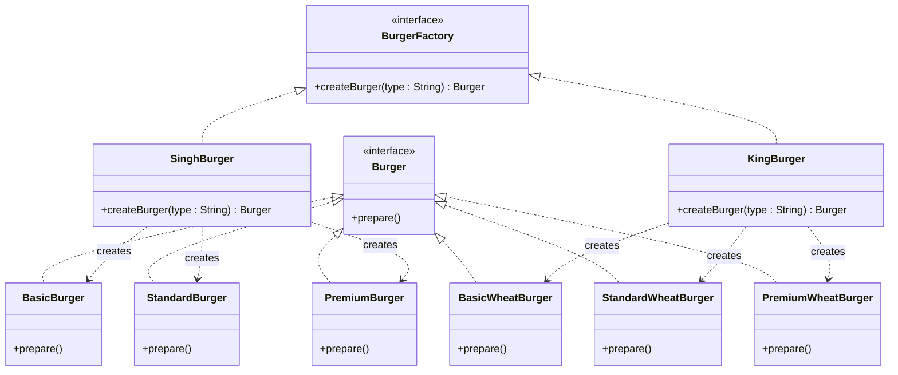

# Factory Method Pattern - Burger Example

```mermaid
classDiagram

    %% =========================
    %% Product Hierarchy
    %% =========================

    class Burger {
        <<interface>>
        +prepare()
    }

    class BasicBurger {
        +prepare()
    }

    class StandardBurger {
        +prepare()
    }

    class PremiumBurger {
        +prepare()
    }

    class BasicWheatBurger {
        +prepare()
    }

    class StandardWheatBurger {
        +prepare()
    }

    class PremiumWheatBurger {
        +prepare()
    }

    Burger <|.. BasicBurger
    Burger <|.. StandardBurger
    Burger <|.. PremiumBurger

    Burger <|.. BasicWheatBurger
    Burger <|.. StandardWheatBurger
    Burger <|.. PremiumWheatBurger


    %% =========================
    %% Factory Hierarchy
    %% =========================

    class BurgerFactory {
        <<interface>>
        +createBurger(type : String) Burger
    }

    class SinghBurger {
        +createBurger(type : String) Burger
    }

    class KingBurger {
        +createBurger(type : String) Burger
    }

    BurgerFactory <|.. SinghBurger
    BurgerFactory <|.. KingBurger


    %% =========================
    %% Factory Dependencies
    %% =========================

    SinghBurger ..> BasicBurger : creates
    SinghBurger ..> StandardBurger : creates
    SinghBurger ..> PremiumBurger : creates

    KingBurger ..> BasicWheatBurger : creates
    KingBurger ..> StandardWheatBurger : creates
    KingBurger ..> PremiumWheatBurger : creates
```
