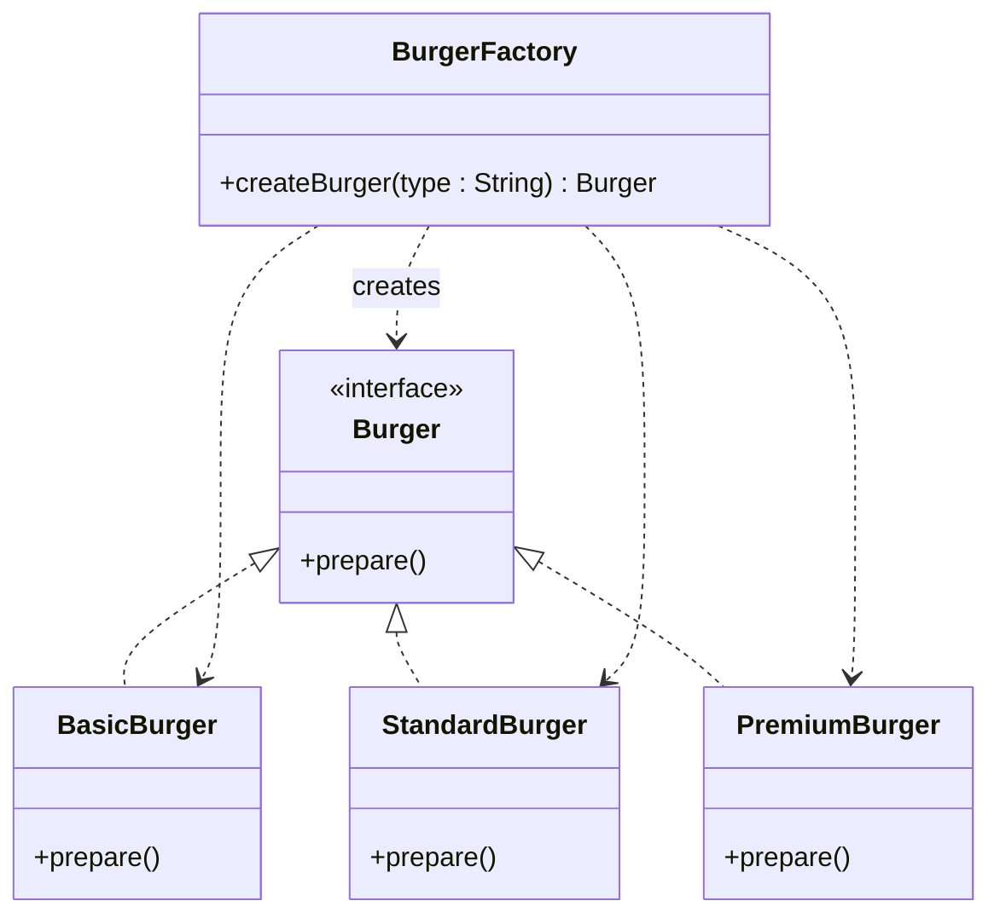

# Simple Factory Pattern - Burger Factory

```mermaid
classDiagram

    class Burger {
        <<interface>>
        +prepare()
    }

    class BasicBurger {
        +prepare()
    }

    class StandardBurger {
        +prepare()
    }

    class PremiumBurger {
        +prepare()
    }

    class BurgerFactory {
        +createBurger(type : String) Burger
    }

    Burger <|.. BasicBurger
    Burger <|.. StandardBurger
    Burger <|.. PremiumBurger

    BurgerFactory ..> Burger : creates
    BurgerFactory ..> BasicBurger
    BurgerFactory ..> StandardBurger
    BurgerFactory ..> PremiumBurger
```
