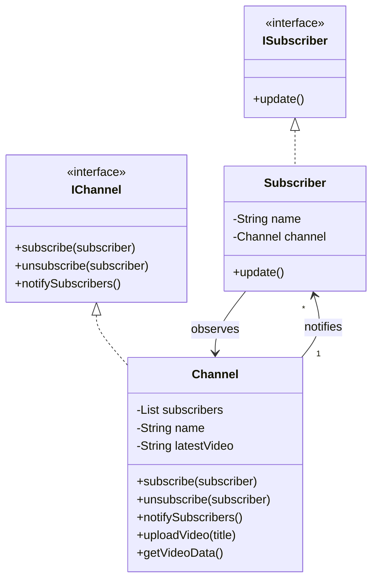

```mermaid
classDiagram

class ISubscriber{
    <<interface>>
    +update()
}

class IChannel{
    <<interface>>
    +subscribe(subscriber)
    +unsubscribe(subscriber)
    +notifySubscribers()
}

class Channel{
    -List subscribers
    -String name
    -String latestVideo
    +subscribe(subscriber)
    +unsubscribe(subscriber)
    +notifySubscribers()
    +uploadVideo(title)
    +getVideoData()
}

class Subscriber{
    -String name
    -Channel channel
    +update()
}

IChannel <|.. Channel
ISubscriber <|.. Subscriber

Channel "1" --> "*" Subscriber : notifies
Subscriber --> Channel : observes
```
