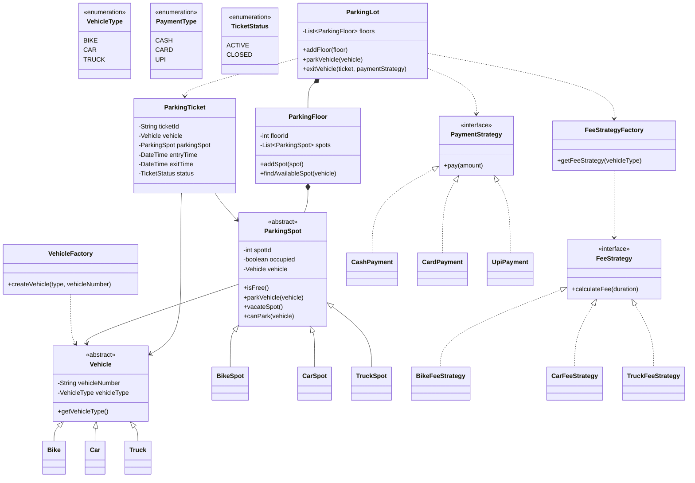

# 🚗 Parking Lot System - UML Class Diagram



---

## Design Patterns Used

### Factory Pattern
- VehicleFactory → Creates Vehicle objects.

### Strategy Pattern
- FeeStrategy → Parking fee calculation.
- PaymentStrategy → Payment processing.

### Composition
- ParkingLot contains multiple ParkingFloors.
- ParkingFloor contains multiple ParkingSpots.

### Inheritance
- Vehicle → Bike, Car, Truck.
- ParkingSpot → BikeSpot, CarSpot, TruckSpot.

---

## Parking Flow

```text
Vehicle Arrives
        |
        v
VehicleFactory
        |
        v
Create Vehicle
        |
        v
ParkingLot
        |
        v
Find Available Spot
        |
        v
Generate Ticket
        |
        v
Park Vehicle
        |
        v
Vehicle Exit
        |
        v
Calculate Fee
        |
        v
Process Payment
        |
        v
Vacate Spot
```
