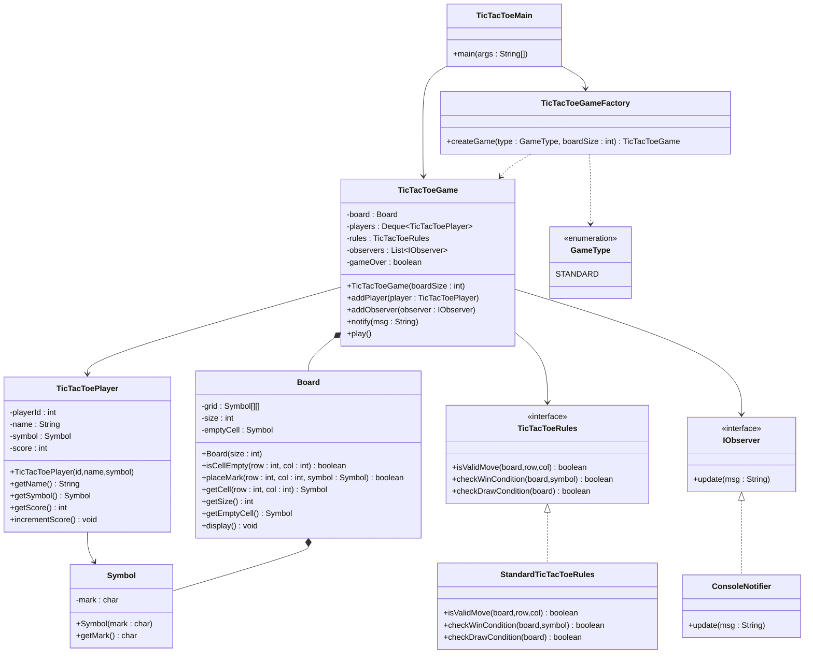

# Tic Tac Toe UML Diagram

```mermaid
classDiagram

%% =========================
%% Observer Pattern
%% =========================

class IObserver {
    <<interface>>
    +update(msg : String)
}

class ConsoleNotifier {
    +update(msg : String)
}

IObserver <|.. ConsoleNotifier


%% =========================
%% Symbol
%% =========================

class Symbol {
    -mark : char
    +Symbol(mark : char)
    +getMark() char
}


%% =========================
%% Board
%% =========================

class Board {
    -grid : Symbol[][]
    -size : int
    -emptyCell : Symbol

    +Board(size : int)
    +isCellEmpty(row : int, col : int) boolean
    +placeMark(row : int, col : int, symbol : Symbol) boolean
    +getCell(row : int, col : int) Symbol
    +getSize() int
    +getEmptyCell() Symbol
    +display() void
}

Board *-- Symbol


%% =========================
%% Player
%% =========================

class TicTacToePlayer {
    -playerId : int
    -name : String
    -symbol : Symbol
    -score : int

    +TicTacToePlayer(id,name,symbol)
    +getName() String
    +getSymbol() Symbol
    +getScore() int
    +incrementScore() void
}

TicTacToePlayer --> Symbol


%% =========================
%% Strategy Pattern
%% =========================

class TicTacToeRules {
    <<interface>>
    +isValidMove(board,row,col) boolean
    +checkWinCondition(board,symbol) boolean
    +checkDrawCondition(board) boolean
}

class StandardTicTacToeRules {
    +isValidMove(board,row,col) boolean
    +checkWinCondition(board,symbol) boolean
    +checkDrawCondition(board) boolean
}

TicTacToeRules <|.. StandardTicTacToeRules


%% =========================
%% Game
%% =========================

class TicTacToeGame {
    -board : Board
    -players : Deque~TicTacToePlayer~
    -rules : TicTacToeRules
    -observers : List~IObserver~
    -gameOver : boolean

    +TicTacToeGame(boardSize : int)
    +addPlayer(player : TicTacToePlayer)
    +addObserver(observer : IObserver)
    +notify(msg : String)
    +play()
}

TicTacToeGame *-- Board
TicTacToeGame --> TicTacToePlayer
TicTacToeGame --> TicTacToeRules
TicTacToeGame --> IObserver


%% =========================
%% Factory Pattern
%% =========================

class GameType {
    <<enumeration>>
    STANDARD
}

class TicTacToeGameFactory {
    +createGame(type : GameType, boardSize : int) TicTacToeGame
}

TicTacToeGameFactory ..> TicTacToeGame
TicTacToeGameFactory ..> GameType


%% =========================
%% Main
%% =========================

class TicTacToeMain {
    +main(args : String[])
}

TicTacToeMain --> TicTacToeGameFactory
TicTacToeMain --> TicTacToeGame
```
